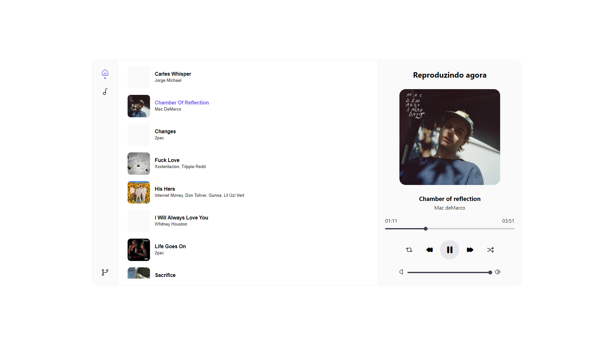

# Melody

Melody é um player de música simples e eficaz, criado com React, projetado para proporcionar uma experiência de audição sem complicações. Este aplicativo permite que você reproduza smúsicas e acompanhe as letras enquanto ouve.



## Funcionalidades

- Reproduza músicas de forma fácil e rápida.
- Acompanhe as letras das músicas enquanto elas tocam.
- Interface de usuário intuitiva e amigável.

## Como Usar

1. Clone este repositório:

   ```
   git clone https://github.com/williamhumbwavali/melody.git
   ```

2. Navegue até o diretório do projeto:

   ```
   cd melody
   ```

3. Instale as dependências:

   ```
   npm install
   ```

4. Inicie o servidor de desenvolvimento:

   ```
   npm start
   ```

5. Abra [http://localhost:3000](http://localhost:3000) em seu navegador da web.

## Link do Projeto

Você pode acessar o projeto publicado em: [melodyonline.vercel.app](https://melodyonline.vercel.app)

## Contribuindo

Contribuições são bem-vindas! Sinta-se à vontade para abrir uma issue ou enviar um pull request.

## Licença

Este projeto está licenciado sob a [Licença MIT](LICENSE).
